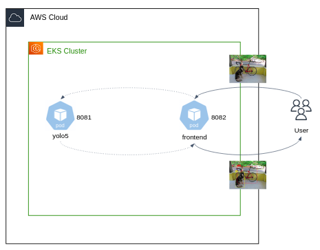
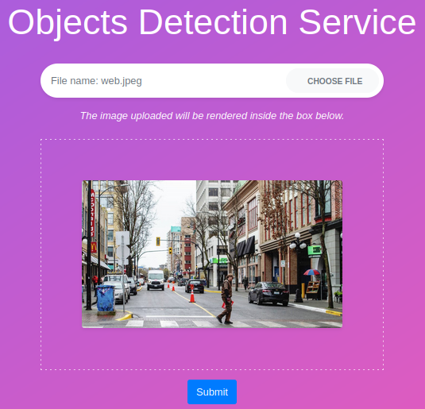
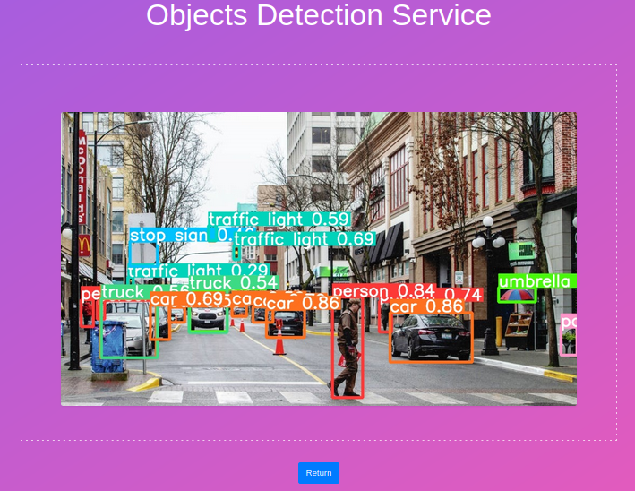

# Microservices - final project exam

## Background

In this project you will deploy an Image Object Detection Service in Kubernetes cluster.


## Preliminaries 

- You should work on the cluster on which you've practiced throughout the course.  
- Make sure you have enough nodes. Clean up your cluster, or increase the Node Group desired capacity if needed.

### Access the kubernetes dashboard 

If you want a dashboard access, `port-forward` the dashboard service by:

```bash
kubectl port-forward -n kubernetes-dashboard service/kubernetes-dashboard 8081:8081 --addresss 0.0.0.0
```

Then open your browser in `http://<could9-env-ec2-instance-public-dns-name>:8081`. 
While `<could9-env-ec2-instance-public-dns-name>` is your Cloud9 public dns address. 

## Guidelines

Here is a high-level architecture of your service: 



The service is composed by 2 microservices: 

1. The `frontend` service which is web UI allows end-users to upload images from their local file system. The app is listening on port `8082`, code can be found in `exam/fronetend`. The service expect an environment variable called `YOLO5_URL`, which represents the address of the `yolo5` service (including port number and `http://`).
2. The `yolo5` service is based on the [YoloV5 model](https://github.com/ultralytics/yolov5) that can detect 80 different objects in natural images. The service is listening on port `8081`, app code can be found under `exam/yolo5`.

Here is an example of what you should see:



And after clicking on the submit button:



Your goal is to deploy the services in your cluster, then use the `kubectl port-forward` command to visit the `frontend` service and check that it's working properly. 

## Submission 

Demonstrate to your course tutor how your app is functioning properly, and put all your YAML manifests within the `exam` directory on your Cloud9 environment.

# Good Luck