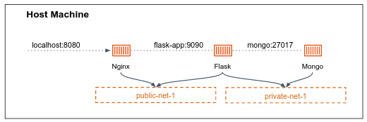

# Docker containers storage

## Docker data persistence

By default, all files created inside a container are stored on a writable container layer.
This means that the data doesn't persist when that container no longer exists.

Docker has two options for containers to store files on the host machine, so that the files are persisted even after the container stops: **volumes**, and **bind mounts**.

## Bind mounts 

**Bind mounts** provide a way to mount a directory or file **from the host machine into a container**.
Bind mounts directly map a directory or file on the host machine to a directory in the container. 

Let's take the old good `nginx` image:

```bash
docker run --rm -p 8080:80 -v /path/on/host:/usr/share/nginx/html --name my-nginx nginx:latest
```

In this example, we're running an Nginx container while the `-v /path/on/host:/usr/share/nginx/html` flag specifies the bind mount.
It maps the directory `/path/on/host` on the host machine to the `/usr/share/nginx/html` directory inside the container.

Whenever the `my-nginx` container is accessing `/usr/share/nginx/html` path, the directory it actually sees is `/path/on/host` on the host machine.
More than that, every change the container does to the `/usr/share/nginx/html` directory will reflect in the corresponding location on the host machine, `/path/on/host`, due to the bind mount.
The other way also applies, changes made on the host machine in `/path/on/host` will be visible inside the container under `/usr/share/nginx/html`.

As you may know, `/usr/share/nginx/html` is the location from which Nginx serves static content files.
In that way, files you'll place in `/path/on/host` on your host machine, will be served by the running nginx container, without the need to copy those files to the container during build time.

Bind mounts are commonly used for development workflows, where file changes on the host are immediately reflected in the container without the need to rebuild or restart the container. 
They also allow for easy access to files on the host machine, making it convenient to provide configuration files, logs, or other resources to the container.

> ### :pencil2: Persist nginx 
> 
> 1. In you host machine, create a directory and put some sample `index.html` file in it (search for sample file in the internet).
> 2. Run an nginx container while mapping the path `/usr/share/nginx/html` within the container, to your created directory.
> 3. Open up your browser and visit the nginx webserver: `http://localhost:8080`. Make sure the nginx serves your file.
> 4. On your host machine, delete `index.hmtl`.
> 5. Refresh the server and make sure the nginx is responding with `404` page not found error. 

## Volumes 

**Docker volumes** is another way to persist data in containers. 
While bind mounts are dependent on the directory structure and OS of the host machine, volumes are logical space that completely managed by Docker.
Volumes offer a higher level of abstraction, allow us to work with different kind of storages, e.g. volumes stored on remote hosts or cloud providers.
Volumes can be shared among multiple containers.

### Create and manage volumes

Unlike a bind mount, you can create and manage volumes outside the scope of any container.

```bash 
docker volume create my-vol
```

Let's inspect the created volume:

```bash
$ docker volume inspect my-vol
[
    {
        "CreatedAt": "2023-05-10T14:28:15+03:00",
        "Driver": "local",
        "Labels": {},
        "Mountpoint": "/var/lib/docker/volumes/my-vol/_data",
        "Name": "my-vol",
        "Options": {},
        "Scope": "local"
    }
]
```

Inspecting the volume discovers the real location that the data will be stored on the host machine: `/var/lib/docker/volumes/my-vol/_data`.

The `local` volume driver is the default built-in driver that stores data on the local host machine.
But docker offers [many more](https://docs.docker.com/engine/extend/legacy_plugins/#volume-plugins) drivers that allow you to create different types of volumes that can be mapped to your container.
For example, the [Azure File Storage plugin](https://github.com/Azure/azurefile-dockervolumedriver) lets you mount Microsoft Azure File Storage shares to Docker containers as volumes.

The following example mounts the volume `my-vol` into `/usr/share/nginx/html` in the container.

```bash
docker run --rm --name my-nginx -v my-vol:/usr/share/nginx/html nginx:latest
```

Essentially we've got the same effect as the above example, but now the mounted volume is not just a directory in the OS, 
but logically managed by docker. 

Can you see how elegant is it? volumes provide a seamless abstraction layer for persisting data within containers.
The container believe it reads and writes data from some location in his file system (`/usr/share/nginx/html`), without any knowledge of the underlying storage details (of the `my-vol` volume). 
If we would have used the Azure File Storage plugin, the data would be actually stored in the cloud.

Remove a volume:

```bash
docker volume rm my-vol
```

### More about volumes

- A given volume can be mounted into multiple containers simultaneously. 
- When no running container is using a volume, the volume is still available to Docker and is not removed automatically.
- If you mount an **empty volume** into a directory in the container in which files or directories exist, these files or directories are **propagated (copied)** into the volume. 
- Similarly, if you start a container and specify a volume which does not already exist, an empty volume is created for you. This is a good way to pre-populate data that another container needs.
- If you mount a **bind mount** or **non-empty volume** into a directory in the container in which some files or directories exist, these files or directories are **obscured by the mount**.

## `tmpfs` mounts

Volumes and bind mounts let you share files between the host machine and container so that you can persist data even after the container is stopped.

As opposed to volumes and bind mounts, a **tmpfs mount** is temporary file system, and only persisted in the host memory (RAM). 
When the container **stops**, the tmpfs mount is removed, and files written there won't be persisted.

This is useful to temporarily store sensitive files that you don't want to persist in either the host or the container writable layer.

To use a tmpfs mount in a container, use the `--tmpfs` flag.
There is no source for tmpfs mounts. The following example creates a tmpfs mount at `/ap`p in a Nginx container. 

```bash
docker run -d \
  -it \
  --name tmptest \
  --tmpfs /app \
  nginx:latest
```

## Summary 

No matter which type of mount you choose to use, the data looks the same **from within the container**. 
It is exposed as either a directory or an individual file in the container's filesystem.

An easy way to visualize the difference among volumes, bind mounts, and tmpfs mounts is to think about where the data lives on the host machine.


- **Volumes** are stored in a part of the host filesystem which is **managed by
  Docker** (`/var/lib/docker/volumes/` on Linux). Non-Docker processes should not
  modify this part of the filesystem.

- **Bind mounts** may be stored *anywhere* on the host system. They may even be
  important system files or directories. Non-Docker processes on the host machine
  or a Docker container can modify them at any time.

- **`tmpfs` mounts** are stored in the host system's memory only, and are never
  written to the host system's filesystem.

# Exercises

### :pencil2: Persist MongoDB database

Your goal is to run MongoDB container from the previous exercise while the data is stored persistently.



Make sure the data is persistent by `docker kill` the container and create a new one.  
