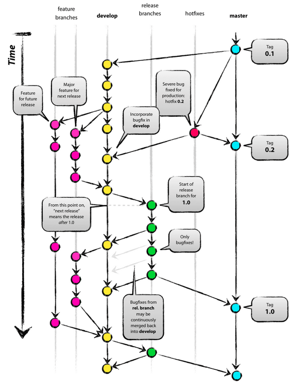
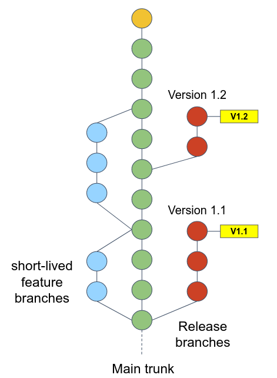
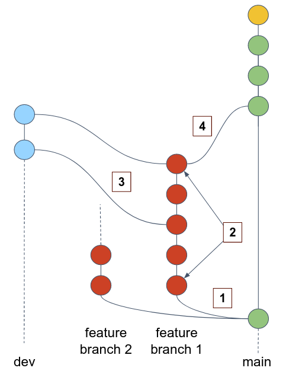

# Continuous deployment with ArgoCD

## Git workflows

Git workflows refer to the different approaches or strategies that teams can adopt when using Git in their software development projects.

### GitFlow

Gitflow is a git branching model that involves the use of feature branches and multiple primary branches. 



For more information, review the [original publication](https://nvie.com/posts/a-successful-git-branching-model/) of GitFlow model by Vincent Driessen at nvie.

### Trunk-based

The Trunk Based Git Workflow is a development approach where all developers work on a single branch called the `trunk` or `main` branch.
It encourages small, frequent commits and emphasizes **continuous integration and delivery** (CD).
This workflow promotes collaboration and reduces integration issues but requires strong automated testing and a high level coding skills of team members.



Here is the workflow:

1. Developers commit their changes directly into `main`, then push their work to remote. Developers _may_ create a short-lived feature branch to test their work locally. The `main` branch is **always** assumed to be stable, without any issues, ready to be released in any moment. 
2. At some point, developers release a new version by branching out from `main` into to `release` branch. A few more changes might be committed before the release is ready.

## Intro to ArgoCD 

GitOps is a DevOps methodology that uses Git as the **single source of truth** for declarative infrastructure and application code. 

Argo CD is a declarative, GitOps continuous delivery tool for Kubernetes.

## Installation 

```bash 
kubectl create namespace argocd
kubectl apply -n argocd -f https://raw.githubusercontent.com/argoproj/argo-cd/stable/manifests/install.yaml
```

Argo CD is implemented as a kubernetes controller which continuously monitors running applications and compares the current, live state against the desired target state (as specified in the Git repo). 

Visit the UI sever by:

```bash
kubectl port-forward svc/argocd-server -n argocd 8080:443 --address 0.0.0.0
```

The username is `admin`, the initial password can be retrieved by:

```bash 
kubectl get secret argocd-initial-admin-secret -n argocd -o jsonpath="{.data.password}" | base64 --decode
```

# Exercises 

### :pencil2: Create Git repo using AWS CodeCommit

1. Open the CodeCommit console at https://console.aws.amazon.com/codesuite/codecommit/home
2. Choose the AWS Region where you want to create the repository.
3. On the **Repositories** page, choose **Create repository**.
4. On the **Create repository** page, in **Repository name**, enter a name for the repository.

#### Clone to your local environment using SSH

1. Generate SSH key and add it to your AWS IAM user

```bash
ssh-keygen -t rsa -b 2048 -f ~/.ssh/id_rsa -N "" 
aws iam upload-ssh-public-key --user-name $C9_USER --ssh-public-key-body "$(cat /home/ubuntu/.ssh/id_rsa.pub)"
```

2. Clone the repo by:

```bash
git clone ssh://YOUR_SSHPublicKeyId@YOUR_REPO_SSH_URL
```

While changing `YOUR_SSHPublicKeyId` to the `SSHPublicKeyId` printed in the previous command, and `YOUR_REPO_SSH_URL` to your repo SSH url.

#### Push your app configuration

1. `cd` into your repo directory, create the file `k8s/release-0.8.0.yaml` (copy it from our shared repo). 
2. Commit and push (`git add . && git commit -m "release-0.8.0" && git push`).

### :pencil2: Create an application from your Git repo

1. In the Argo CD UI, choose **Settings**, then **Repositories**.
2. Define your Git repo. Notes:
   - Method is `SSH`.
   - Repo URL is: `ssh://YOUR_SSHPublicKeyId@YOUR_REPO_SSH_URL`.
   - Your private key can be printed by `cat ~/.ssh/id_rsa`.
   - Select **Skip server verification**.

Now let's define an argo app:

3. Choose **Applications**, then **New App**.
   - The app name can be `online-boutique`.
   - Set sync policy to **Manual**.
   - Keep all other defaults.

Make sure your app as deployed in k8s is synced with the version committed in Git. Manually sync it if needed.

4. Change to values in `k8s/release-0.8.0.yaml`, commit and push. Sync the change in your app in Argo.  

### :pencil2: Create multi environment CD pipeline with ArgoCD

Let's review the following Git workflow:



1. Developers branching our from an up-to-date `main` (or `master`) branch into their feature branch. 
2. They commit changes into their feature branch.
3. At some point, they want to test their changes in Development environment. They merge the feature branch into `dev` branch, and push to remote.
4. After the changes have been tested in development environment and a few more fixes has been committed, the developer creates a Pull Request from their feature branch into `main`.
5. The `main` branch can be deployed to production environment directly after the merge. 

Design the above workflow to deploy the Online Boutique in your cluster. 

**Guidelines:**

1. In your cluster, create 2 namespaces: `dev` and `prod`. 
2. In your local Git repo, from the `master` branch, checkout a new branch named `dev`. Commit and push.
3. In Argo, create 2 apps:
  - `online-boutique-dev`, originated from `dev` branch, deployed into `dev` namespace in kubernetes. As this app reflects development env, your can configure changes to auto sync (we want to make the development process as smooth as possible).
  - `online-boutique-prod`, originated from `master` branch, deployed into `prod` namespace in kubernetes.

Deploy some "feature" according to your workflow:

1. From `master` branch, create a "feature" branch, e.g. `myfeature`.
2. Checkout your feature branch and change some value in the `k8s/release-0.8.0.yaml`. Push it.
3. Merge your feature branch into `dev`, push it, watch how Argo is deploying your change automatically.
4. If you are happy with the change in the development env, enter your repo in CodeCommit and create a pull request from your feature branch into `master`. 
5. "Review" it and merge it. 
6. Now your changes have been merged into `master` branch, which reflects production, deploy your changes by syncing the app from the Argo UI.
