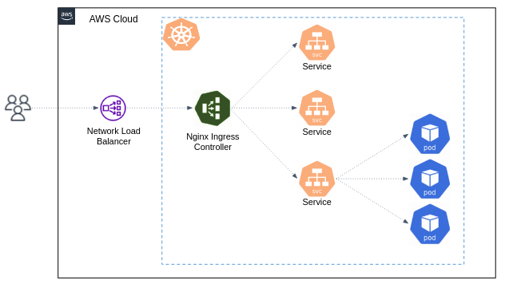

# Kubernetes networking

The Kubernetes networking model facilitates communication between pods within a cluster, and from the outside world into the cluster.

- Pods can communicate with each other using their internal IP addresses. 
  Every pod in a cluster can reach every other pod without NAT.
- **Services** provide a stable endpoint (`ClusterIP`) that abstracts the underlying pod instances. Services enable load balancing and automatic discovery of pod changes.
  Pods can use the service name as a DNS entry to connect to other services.
- The **kube-proxy** is a network proxy that runs on each node in your cluster. It allows network communication to your Pods from network sessions inside or outside your cluster.


So far, we've seen how to use Services to publish services only for consumption **inside your cluster**.

## Expose applications outside the cluster using a Service of type `LoadBalancer`

Kubernetes allows you to create a Service of `type=LoadBalancer` (no need to apply the below example):

```yaml
apiVersion: v1
kind: Service
metadata:
  name: my-service
spec:
  type: LoadBalancer
  selector:
    app.kubernetes.io/name: MyApp
  ports:
    - protocol: TCP
      port: 80
      targetPort: 9376
  clusterIP: 10.0.171.239
```

This Service takes effect only on cloud providers which support external load balancers (like AWS ELB). 
Applying this Service will **provision a load balancer for your Service**.


Traffic from the Elastic Load Balancer is directed to the backend Pods by the Service. The cloud provider decides how it is load balanced across different cluster's Nodes.

Note than the actual creation of the load balancer happens asynchronously, and information about the provisioned balancer is published in the Service's `.status.loadBalancer` field.

## Ingress and Ingress controller 

A Service of type `LoadBalancer` is the core mechanism that allows you to expose application to clients outside the cluster. 

What now? should we set up a separate Elastic Load Balancer for each Service we wish to make accessible from outside the cluster?
Doesn't this approach seem inefficient and overly complex in terms of resource utilization and cost?

It is. Let's introduce an **Ingress** and **Ingress Controller**.

Ingress Controller is an application that runs in the Kubernetes cluster that manage external access to services within the cluster. 
There are [many Ingress Controller implementations](https://kubernetes.io/docs/concepts/services-networking/ingress-controllers/) for different usages and clusters. 

[Nginx ingress controller](https://github.com/kubernetes/ingress-nginx) is one of the popular used one. 
Essentially, it's the same old good Nginx webserver app, exposed to be available outside the cluster (using Service of type `LoadBalancer`), and configured to route incoming traffic to different Services in the cluster (a.k.a. reverse proxy). 



**Ingress** is another Kubernetes object, that defines the **routing rules** for the Ingress Controller.

Let's deploy an Ingress Controller and apply an Ingress with routing rules. 

## Deploy the Nginx Ingress Controller

Ingress controllers are not started automatically with a cluster, you have to deploy it manually. 
We'll deploy the [Nginx Ingress Controller behind an AWS Network Load Balancer (NLB)](https://kubernetes.github.io/ingress-nginx/deploy/#aws).

```bash 
kubectl apply -f https://raw.githubusercontent.com/kubernetes/ingress-nginx/controller-v1.8.2/deploy/static/provider/aws/deploy.yaml
```  

The above manifest mainly creates:

- Deployment `ingress-nginx-controller` of the Nginx webserver.
- Srvice `ingress-nginx-controller` of type `LoadBalancer`. 
- IngressClass `IngressClass` to be used in the Ingress objects (see `ingressClassName` below).
- RBAC related resources. 

Now apply the below Ingress: 

```yaml
# k8s/ingress-demo.yaml

apiVersion: networking.k8s.io/v1
kind: Ingress
metadata:
  name: online-boutique-ing
spec:
  rules:
  - host: # TODO YOUR LB DOMAIN HERE. e.g. www.example.com 
    http:
      paths:
      - path: /
        pathType: Prefix
        backend:
          service:
            name: frontend
            port:
              number: 80
  ingressClassName: nginx
```

When you apply this yaml, an ingress resource will be created managed by the `ingress-nginx` instance.
Nginx is configured to automatically discover all ingress where `ingressClassName: nginx` is present.
Please note that the ingress resource should be placed inside the same namespace of the backend resource.

Visit the application using the NLB domain name. 


#### Ingress vs Ingress Controller

Please make sure you understand the relation between Ingress and Ingress Controller:

**Ingress** only defines the *routing rules*, it is not responsible for the actual routing mechanism.  
An Ingress controller is responsible for fulfilling the Ingress routing rules. 
In order for the Ingress resource to work, the cluster must have an Ingress Controller running.


# Exercise 

### :pencil2: Expose the 2048 game outside the cluster

If you haven't done it yet, deploy the [2048 game dockerized image](https://hub.docker.com/r/alexwhen/docker-2048) as a Deployment in the cluster.

Inspired by the above `Ingress`, expose the 2048 app, so you can play the game using a public URL, without `port-forward`ing.  

Create your subdomain here: 
https://us-east-1.console.aws.amazon.com/route53/v2/hostedzones?region=eu-north-1#ListRecordSets/Z004139713FBMBE0XTBVJ

### :pencil2: Canary using Nginx 

You can add [nginx annotations](https://kubernetes.github.io/ingress-nginx/user-guide/nginx-configuration/annotations/) to specific Ingress objects to customize their behavior.

In some cases, you may want to "canary" a new set of changes by sending a small number of requests to a different service than the production service. 
The [canary annotation](https://kubernetes.github.io/ingress-nginx/user-guide/nginx-configuration/annotations/#canary) enables the Ingress spec to act as an alternative service for requests to route to depending on the rules applied.

In this exercise we'll deploy a canary for the `frontend` service. 

- Make sure the Online Boutique service is up and running in your cluster.
- Deploy the YAML under `k8s/online-boutique/release-0.9.0-frontend.yaml` - this is a Deployment and Service of the `frontend` service version `0.9.0` (which you have `0.8.0` installed on your cluster). 
- If you haven't done it before, create an `Ingress` pointing to your main `frontend` Deployment.
- Create an `Ingress` pointing to your canary Deployment. Here is a skeleton with appropriate annotations: 

```yaml
apiVersion: networking.k8s.io/v1
kind: Ingress
metadata:
  name: canary
  annotations:
    nginx.ingress.kubernetes.io/canary: "true"
    nginx.ingress.kubernetes.io/canary-weight: "5"
spec:
  ingressClassName: nginx
  rules:
     # TODO ....
```

This Ingress routes 5% of the traffic to the canary deployment. Make sure the `host` entry is the same as the main Ingress. 

- Test your configurations by periodically access the application. 

```bash
/bin/sh -c "while sleep 0.05; do (wget -q -O- http://LOAD_BALANCER_DOMAIN | grep Pod -m 1 &); done"
```

**Bonus**: Use [different annotations](https://kubernetes.github.io/ingress-nginx/user-guide/nginx-configuration/annotations/) to perform a canary deployment which routes users based on a request header `FOO=bar`, instead of specific percentage.

Similarly, you can use the Nginx ingress controller to split the traffic using [other strategies, like blue-green, or A/B testing](https://docs.nginx.com/nginx-service-mesh/tutorials/trafficsplit-deployments/). 

### :pencil2: Enforce network policy using Calico 

Calico is a networking and security solution that enables Kubernetes workloads to communicate seamlessly and securely.

In Kubernetes, the default for networking traffic to/from pods is default-allow. 
If you do not lock down network connectivity using network policy, then all pods can communicate freely with other pods.

Install Calico on your EKS cluster using the [official Helm chart](https://docs.tigera.io/calico/latest/getting-started/kubernetes/helm):

1. Add the Calico helm repo:

```bash
helm repo add projectcalico https://docs.tigera.io/calico/charts
```

2. Create the `tigera-operator` namespace.

```bash
kubectl create namespace tigera-operator
```

3. Install the chart with a values file under `k8s/calico-values.yaml`

```bash
helm install calico projectcalico/tigera-operator --version v3.27.0 -f k8s/calico-values.yaml --namespace tigera-operator
```

This demo creates a front-end (denoted by `F`), back-end (`B`), and client (`C`) service.
The demo also creates a management graphical user interface that shows the available ingress and egress paths between each service. 

Before you create any network policies, all services can communicate bidirectionally.
After you apply the network policies, you can see that the client can only communicate with the front-end service, and the back-end only accepts traffic from the front-end.

Apply the front-end, back-end, client, and management user interface services:

```bash
kubectl apply -f calico-demo-apps.yaml
```

Front and back services are provisioned in `stars` namespace, client service in the `client` and management-ui in `management-ui` namespace.

Port-forward the management-ui and take a look on the communication diagram.  

Here is a default-deny [Network Policy](https://kubernetes.io/docs/concepts/services-networking/network-policies/) object. It matches all pod labels, and it doesn't contain any ingress or egress rules.

```yaml
# k8s/calico-demo-network-policy-default-deny.yaml

kind: NetworkPolicy
apiVersion: networking.k8s.io/v1
metadata:
  name: default-deny
spec:
  podSelector:
    matchLabels: {}
```

Apply it in both `stars` and `client` namespaces: 

```bash
kubectl apply -n stars -f k8s/default-deny-np.yaml
kubectl apply -n client -f k8s/default-deny-np.yaml
```

Refresh the management UI (wait for changes to be reflected).
Now that we've enabled isolation, the UI can no longer access the pods, and so they will no longer show up in the UI.

Allow the UI to access the services using network policy objects

```yaml 
# k8s/calico-demo-network-policy-allow-ui.yaml

kind: NetworkPolicy
apiVersion: networking.k8s.io/v1
metadata:
  namespace: stars
  name: allow-ui
spec:
  podSelector:
    matchLabels: {}
  ingress:
    - from:
        - namespaceSelector:
            matchLabels:
              role: management-ui
```

Apply in both namespaces:

```bash
kubectl apply -n stars -f k8s/allow-ui-np.yaml
kubectl apply -n client -f k8s/allow-ui-np.yaml
```

After a few seconds, refresh the UI - it should now show the Services, but they should not be able to access each other any more.

Allow traffic from the frontend to the backend:

```yaml
# k8s/calico-demo-network-policy-backend.yaml

kind: NetworkPolicy
apiVersion: networking.k8s.io/v1
metadata:
  namespace: stars
  name: backend-policy
spec:
  podSelector:
    matchLabels:
      role: backend
  ingress:
    - from:
        - podSelector:
            matchLabels:
              role: frontend
      ports:
        - protocol: TCP
          port: 6379
```

Refresh the UI. You should see the following:

- The frontend can now access the backend (on TCP port 6379 only).
- The backend cannot access the frontend at all.
- The client cannot access the frontend, nor can it access the backend.

Lastly, expose the frontend service to the client namespace

```yaml
# k8s/calico-demo-network-policy-frontend.yaml

kind: NetworkPolicy
apiVersion: networking.k8s.io/v1
metadata:
  namespace: stars
  name: frontend-policy
spec:
  podSelector:
    matchLabels:
      role: frontend
  ingress:
    - from:
        - namespaceSelector:
            matchLabels:
              role: client
      ports:
        - protocol: TCP
          port: 80
```

The client can now access the frontend, but not the backend. Neither the frontend nor the backend can initiate connections to the client. The frontend can still access the backend.

You can clean up the demo by deleting the namespaces:

```bash
kubectl delete ns client stars management-ui
```

For more information about using Calico:     
https://docs.tigera.io/calico/latest/network-policy/get-started/kubernetes-policy/kubernetes-demo


### :pencil2: Setup HTTPS connections with your ingress controller 

Generate a self-signed certificate and private key with (change values accordingly):

```bash
openssl req -x509 -nodes -days 365 -newkey rsa:2048 -keyout KEY_FILE -out CERT_FILE -subj "/CN=YOUR_HOST" -addext "subjectAltName = DNS:YOUR_HOST"
```

Then create the secret in the cluster via:

```bash
kubectl create secret tls CERT_NAME --key KEY_FILE --cert CERT_FILE
```

The resulting secret will be of type `kubernetes.io/tls`.

Inspired by https://raw.githubusercontent.com/kubernetes/website/main/content/en/examples/service/networking/tls-example-ingress.yaml, define your ingress to accept HTTPS requests.

You can force your incoming traffic to use HTTPS by adding the following annotation to the `ingress` object:

```text
nginx.ingress.kubernetes.io/force-ssl-redirect: "true"
```