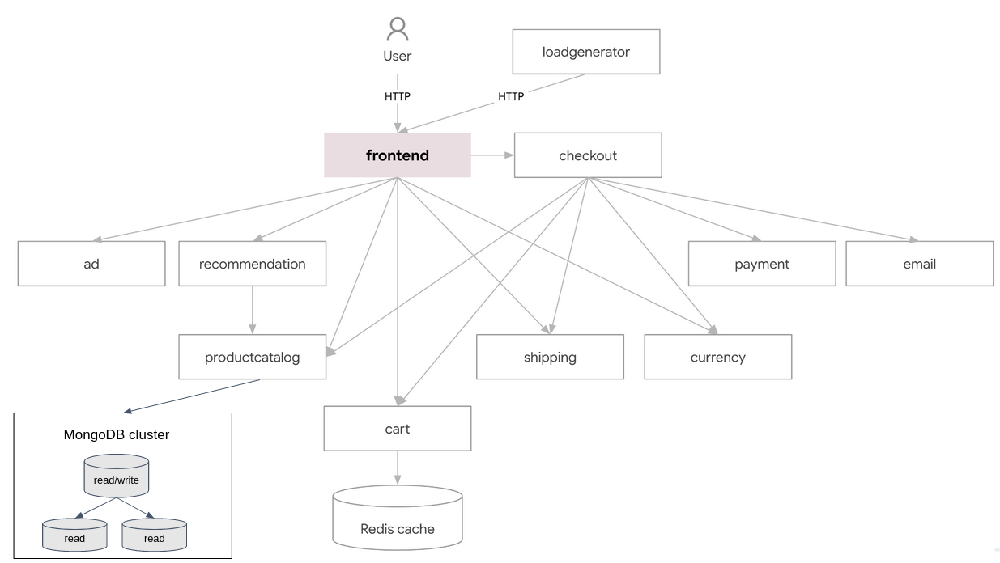
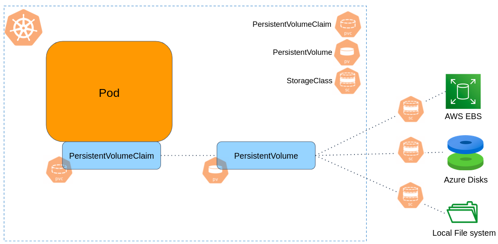

# Kubernetes StatefulSet and Storage

In this tutorial, we will deploy a MongoDB cluster, and integrate it with the `productcatalogservice` service (the service responsible for products catalog of the [Online Boutique](https://github.com/GoogleCloudPlatform/microservices-demo) app).

Currently, the `productcatalogservice` service stores products in a simple `products.json` file within the container. We want this service to dynamically read products from a MongoDB cluster, deployed in k8s.



The MongoDB cluster consists by 3 Pods: One primary replica and two secondary replicas.


## Deploy MongoDB as a StatefulSet

Due to the stateful nature of databases, we need a mechanism to store data in Kubernetes.
So far, Pods in the cluster were ephemeral resources, Pod's container state was not saved, so all of the files that were created or modified during the lifetime of the container are lost.

Kubernetes allows you to bind a [Persistent Volume](https://kubernetes.io/docs/concepts/storage/persistent-volumes/) to a Pod, so the data stored in that volume exist beyond the lifetime of a pod. 
An example for a persistent volume can be an external AWS EBS, Azure disks, or a "logical volume" that mounts a file or directory from the host node's filesystem into your Pod.

One more problem that arise here is the "identity" of Pods. 
The MongoDB cluster consists by 3 Pods, although all of them have the same container spec (based on the [mongo image](https://hub.docker.com/_/mongo)), one Pod is functioning as a **primary**, while the others are **secondaries** replicas. 

Obviously we cannot use Deployment here. In a Deployment, which manage an identical set of Pods, we can not prefer "this pod" over "that pod", each pod is interchangeable with any other pod. 
In the MongoDB case, we should know that "pod number 1" is the primary, while "pods 2 and 3" are secondaries replicas. 
In that sense, Pod has an "identity". 

Here **StatefulSet** comes in.

A [StatefulSet](https://kubernetes.io/docs/concepts/workloads/controllers/statefulset/) is the workload resource for **stateful** applications deployed in Kubernetes.
Similarly to Deployment, StatefulSet manages the deployment and scaling of a set of Pods, but provides **guarantees about the ordering and uniqueness of these Pods**.

Like a Deployment, a StatefulSet manages Pods that are based on an identical container spec. 
Unlike a Deployment, a StatefulSet maintains a **sticky identity** for each of its Pods. 

We'll explain these concepts on the below example. Here is a complete example to provision a MongoDB cluster:

```yaml
# k8s/mongo-statefulset.yaml

apiVersion: apps/v1
kind: StatefulSet
metadata:
  name: mongo
spec:
  serviceName: "mongo-service"
  replicas: 3
  selector:
    matchLabels:
      app: mongo
  template:
    metadata:
      labels:
        app: mongo
    spec:
      containers:
        - name: mongo
          image: mongo:5
          command:
            - mongod
            - "--replSet"
            - myReplicaSet
            - "--bind_ip_all"
          ports:
            - containerPort: 27017
          volumeMounts:
            - name: mongo-persistent-storage
              mountPath: /data/db
  volumeClaimTemplates:
  - metadata:
      name: mongo-persistent-storage
    spec:
      storageClassName: gp2
      accessModes: [ "ReadWriteOnce" ]
      resources:
        requests:
          storage: 2Gi
---
apiVersion: v1
kind: Service
metadata:
  name: mongo-service
  labels:
    app: mongo
spec:
  clusterIP: None
  selector:
    app: mongo
  ports:
  - port: 27017
    targetPort: 27017
```

After applying the above manifest.

Now we need to initiate the mongo cluster. In order to do so, get a Mongo shell access to the first Pod of the StatefulSet, denoted by `mongo-0`.

```console
$ kubectl exec -ti mongo-0 -- mongosh
Current Mongosh Log ID:	654f5d7fbe499b77952befe7
Connecting to:		mongodb://127.0.0.1:27017/?directConnection=true&serverSelectionTimeoutMS=2000&appName=mongosh+2.0.1
Using MongoDB:		7.0.2
Using Mongosh:		2.0.1
...
```

From the opened Mongo Shell, initialize the Mongo cluster:

```javascript
rs.initiate({_id: "myReplicaSet", members: [{ _id: 0, host: "mongo-0.mongo-service" }, { _id: 1, host: "mongo-1.mongo-service" }, { _id: 2, host: "mongo-2.mongo-service" }]})
```

Then find which Pod has been assigned as primary:

```javascript
db.runCommand("ismaster")
```

The `primary:` entry indicate which Pod is your primary replica. 

```javascript
{
  // lines removed for clearer output
   
  hosts: [
    'mongo-0.mongo-service:27017',
    'mongo-1.mongo-service:27017',
    'mongo-2.mongo-service:27017'
  ],
  setName: 'myReplicaSet',
  primary: 'mongo-0.mongo-service:27017',          <======== Addrss of primary replica
  me: 'mongo-2.mongo-service:27017',
  
  // lines removed for clearer output
}
```

## StatefulSet characteristics

```console 
$ kubectl get pods -l app=mongo
NAME      READY   STATUS    RESTARTS   AGE
mongo-0   1/1     Running   0          12m
mongo-1   1/1     Running   0          12m
mongo-2   1/1     Running   0          12m
```

As can be seen, the StatefulSet assigns each Pod a unique, stable name of the form `<statefulset-name>-<ordinal-index>`, which results in Pods named `mongo-0`, `mongo-1`, and `mongo-2` (as opposed to Deployments, in which Pods got a random name). 

Each Pod in the Mongo cluster has its own persistent volume: 

```console
$ kubectl get persistentvolumeclaim
NAME                               STATUS   VOLUME                                     CAPACITY   ACCESS MODES   STORAGECLASS   AGE
mongo-persistent-storage-mongo-0   Bound    pvc-d45d676d-abff-4d0c-89ac-545a29f3d339   2Gi        RWO            standard       26m
mongo-persistent-storage-mongo-1   Bound    pvc-7b35b117-5ad4-433d-82a7-99968d89615c   2Gi        RWO            standard       26m
mongo-persistent-storage-mongo-2   Bound    pvc-0d5b76ce-e5aa-44a8-bc16-21070e0a5e45   2Gi        RWO            standard       26m
```

Let's introduce 3 important Kubernetes objects here:

- **PersistentVolume (PV)** is a piece of storage in the cluster.
  For example, the storage attached to the `mongo-0` Pod is `pvc-d45d676d-abff-4d0c-89ac-545a29f3d339`.
  In our case, this storage has been provisioned dynamically as part of the StatefulSet provisioning. This storage is of class `standard` (the default storage class of your Minikube cluster. We'll discuss it soon).

- **PersistentVolumeClaim (PVC)** is a **request** for storage. Pods can not use PersistentVolumes (PV) directly, instead, they do it by another object called PersistentVolumeClaim (PVC), which **claims** a PV. Pods are bound to PVC, which bound to PV resources.
- **Storage Class (SC)** provides a way to describe the "classes" of storage that the cluster can provision. Usually Kubernetes clusters have default storage class, but you can [create other storage classes](https://kubernetes.io/docs/concepts/storage/storage-classes/#the-storageclass-resource).
  The `StorageClass` object contains the fields `provisioner`, which determines volume driver used to create the actual storage. For example, `kubernetes.io/aws-ebs` is the provisioner to create AWS EBS volumes, or `kubernetes.io/azure-disk` to create disks in Azure. 
  Obviously, there should be a well-defined interface between the storage system of the cloud provider, and Kubernetes. The most commonly used interface today is the [Container Storage Interface (CSI)](https://github.com/container-storage-interface/spec).
  
  In Minikube clusters, the `standard` Storage Class has the `k8s.io/minikube-hostpath` provisioner, which mount a directory in the node's file system as a "storage". This Storage Class should be used for development only, it is not useful for real data persistence. 
  


In the `mongo` example above, the `VolumeClaimTemplate` entry defined in a StatefulSet creates a **PersistentVolumeClaim (PVC)** for each Pod. 
Then for each **PersistentVolumeClaim (PVC)**, a single **PersistentVolume** is created with a **StorageClass** of `standard` and 2 GiB of provisioned storage.
When a Pod is (re)scheduled onto a node, for example as a result of a rolling update, its knows the PersistentVolumes associated with it. That way Pods can be failed or replaced, and returned to the same volume the previous Pod has.
In our example, Pod `mongo-0` will always be mounted to `pvc-d45d676d-abff-4d0c-89ac-545a29f3d339` volume.


> [!NOTE]
> The actual volumes have been created dynamically when the StatefulSet object was created. This is known as **dynamic provisioning**. 
> Without dynamic provisioning, cluster administrators have to manually make calls to their cloud or storage provider to create new storage volumes, and then create PersistentVolume and PersistentVolumeClaim objects to represent them in Kubernetes.
> In the tutorial exercises below there is an exercise to create storage objects manually. 

What else should we say about the `mongo` StatefulSet? 

Pods also have a **stable network identity**. 
For example, let's say the Mongo primary replica is `mongo-0` (the primary is the only member in the replica set that receives write operations),
accessing the DB from another application in the cluster is simply done by `mongo-0.mongo-service`. 
The domain takes the form: `<pod-name>.<service-name>`.

Note that the `mongo-service` Service created for the StatefulSet, has an entry `ClusterIP: none`. This is known as a [Headless Service](https://kubernetes.io/docs/concepts/services-networking/service/#headless-services). 
**Headless Service** doesn't have Cluster IP and no load-balancing mechanism for the different Pods, instead, it is used for **discovery mechanisms**.
When resolving the DNS name `mongo-service`, you don't get an IP address of **one** of the Pods this service is pointing to (as done in a regular service), but you get the IP addresses of **all** the Pods this service is pointing to. 

```bash 
kubectl run -i --tty --rm headless-test --image=alpine --restart=Never -- nslookup mongo-service
```

Since in StatefulSet each Pod has an "identity", there is no any meaning to load balancing the traffic evenly across different Pods.
We use the Service just to group the Pods together under domain name, but the actual communication is done with particular Pod. 
In our case, if you want to perform read/write to the MongoDB, talk with `mongo-0.mongo-service`, if you want to read only, talk with either `mongo-1.mongo-service`, or `mongo-2.mongo-service`.


## Deployment and Scaling Guarantees in StatefulSet

When the `mongo` example above is created, three Pods will be deployed **in the order**: `mongo-0`, `mongo-1`, `mongo-2`.
`mongo-1` will not be deployed before `mongo-0` is **Running** and **Ready**, the same goes for `mongo-2`. 

If you were to scale the StatefulSet such that `replicas=1` (only 1 replica of Mongo), `mongo-2` would be terminated first, then `mongo-1`.
`mongo-1` would not be terminated until `mongo-2` is fully shutdown and deleted.

A StatefulSet's `.spec.updateStrategy` field allows you to configure and disable automated rolling updates.
When a StatefulSet's `.spec.updateStrategy.type` is set to `RollingUpdate`, the StatefulSet will delete and recreate each Pod in the StatefulSet.
It will proceed in the same order as Pod termination (from the largest ordinal to the smallest), updating each Pod one at a time.

## More on Volumes

Kubernetes supports [many types](https://kubernetes.io/docs/concepts/storage/volumes/#volume-types) of persistent volumes.

As your Minikube cluster deployed on your local machine, there is no any real "volume". 
Thus, the `hostPath` volumes type is used, which mounts a file or directory from the host node's file system into the Pod.

### Volume data protection

PersistentVolumeClaims (PVCs) and PersistentVolumes (PVs) are not a joke. 
These are the objects in the cluster representing real infrastructure containing your ⚠️⚠️ **customer's data** ⚠️⚠️. 

You don't want to delete a (PVCs) or (PVs) by mistake, and lose your data as a result. 

Kubernetes is shipped with a **Storage Object in Use Protection feature** to deal with that risk. 
PersistentVolumeClaims (PVCs) **in active use by a Pod** and PersistentVolume (PVs) that are bound to PVCs are not removed immediately from the system.

- PVC removal is postponed until the PVC is no longer actively used by any Pods.
- PV removal is postponed until the PV is no longer bound to a PVC.

And what about the underlying infrastructure that the PV in bound to (such as an AWS EBS or GCE PD volume)? 

Kubernetes allows reclamation of the PersistentVolume resource by another PersistentVolumeClaim.
The reclaim policy for a PersistentVolume tells the cluster what to do with the volume after it has been released of its claim. 

Volumes reclaim policy can either be `Retained` or `Deleted`.

- `Retain` - When the PersistentVolume is deleted, the associated storage asset in external infrastructure (AWS EBS or Azure disks) still exists. 
- `Delete` - When the PersistentVolume is deleted, the associated storage asset in the external infrastructure is removed as well.


# Exercise

Before you start, pull the repo to get the up-to-date content:

```bash
cd ~/environment/Microservices23
git pull
```

### :pencil2: Enable EBS CSI driver

The [EBS CSI driver](https://github.com/kubernetes-sigs/aws-ebs-csi-driver) allows you to create and manage EBS volumes as storage for the Kubernetes Volumes that you create. 

The Amazon EBS CSI plugin requires IAM permissions to make calls to AWS APIs on your behalf. For more information, see [Creating the Amazon EBS CSI driver IAM role](https://docs.aws.amazon.com/eks/latest/userguide/csi-iam-role.html).

1. Open the Amazon EKS console at https://console.aws.amazon.com/eks/home#/clusters
2. In the left navigation pane, choose **Clusters**.
3. Choose the name of the cluster that you want to configure the Amazon EBS CSI add-on for.
4. Choose the **Add-ons** tab.
5. Choose **Get more add-ons**.
6. On the **Select add-ons** page, do the following:

    - In the **Amazon EKS-addons** section, select the **Amazon EBS CSI Driver** check box.
    - Choose **Next**.
7. On the **Configure selected add-ons settings** page, under **IAM role**, select **Inherit from node**.
8. On the **Review and add** page, choose **Create**. 


### :pencil2: Integrate the MongoDB cluster into the `productcatalogservice` service.

If you haven't done it before, provision a Mongo cluster by applying the YAML manifest presented in the beginning of the tutorial (the manifest can be found under `k8s/mongo-statefulset.yaml`). Follow the instructions to initiate the Mongo replicaset, make sure you know the address of your primary replica.  

1. Under `k8s/productcatalogservice` you'll find the source code for the Product Catalog service, with modifications for work with the MongoDB cluster.
2. Build the image, push it to ECR repo.
3. Connect to the Mongo shell of your primary replica and insert some products data:

```bash
kubectl exec -ti PRIMARY_REPLICA_POD -- mongosh
```

Your shell prompt should look like: `myReplicaSet [direct: primary] test>`. 

In the opened Mongo shell, use some DB name to your choice:

```text
use YOUR_DB_NAME
```

Insert some products data to a collection named `products`: 

```javascript
db.products.insertMany(
[
    {
    "id": "OLJCESPC7Z",
    "name": "Sunglasses",
    "description": "Add a modern touch to your outfits with these sleek aviator sunglasses.",
    "picture": "/static/img/products/sunglasses.jpg",
    "priceUsd": {
        "currencyCode": "USD",
        "units": 19,
        "nanos": 990000000
        },
    "categories": ["accessories"]
    },
    {
        "id": "66VCHSJNUP",
        "name": "Tank Top",
        "description": "Perfectly cropped cotton tank, with a scooped neckline.",
        "picture": "/static/img/products/tank-top.jpg",
        "priceUsd": {
            "currencyCode": "USD",
            "units": 18,
            "nanos": 990000000
        },
        "categories": ["clothing", "tops"]
    },
    {
        "id": "1YMWWN1N4O",
        "name": "Watch",
        "description": "This gold-tone stainless steel watch will work with most of your outfits.",
        "picture": "/static/img/products/watch.jpg",
        "priceUsd": {
            "currencyCode": "USD",
            "units": 109,
            "nanos": 990000000
        },
        "categories": ["accessories"]
    },
    {
        "id": "L9ECAV7KIM",
        "name": "Loafers",
        "description": "A neat addition to your summer wardrobe.",
        "picture": "/static/img/products/loafers.jpg",
        "priceUsd": {
            "currencyCode": "USD",
            "units": 89,
            "nanos": 990000000
        },
        "categories": ["footwear"]
    },
    {
        "id": "2ZYFJ3GM2N",
        "name": "Hairdryer",
        "description": "This lightweight hairdryer has 3 heat and speed settings. It's perfect for travel.",
        "picture": "/static/img/products/hairdryer.jpg",
        "priceUsd": {
            "currencyCode": "USD",
            "units": 24,
            "nanos": 990000000
        },
        "categories": ["hair", "beauty"]
    },
    {
        "id": "0PUK6V6EV0",
        "name": "Candle Holder",
        "description": "This small but intricate candle holder is an excellent gift.",
        "picture": "/static/img/products/candle-holder.jpg",
        "priceUsd": {
            "currencyCode": "USD",
            "units": 18,
            "nanos": 990000000
        },
        "categories": ["decor", "home"]
    },
    {
        "id": "LS4PSXUNUM",
        "name": "Salt & Pepper Shakers",
        "description": "Add some flavor to your kitchen.",
        "picture": "/static/img/products/salt-and-pepper-shakers.jpg",
        "priceUsd": {
            "currencyCode": "USD",
            "units": 18,
            "nanos": 490000000
        },
        "categories": ["kitchen"]
    },
    {
        "id": "9SIQT8TOJO",
        "name": "Bamboo Glass Jar",
        "description": "This bamboo glass jar can hold 57 oz (1.7 l) and is perfect for any kitchen.",
        "picture": "/static/img/products/bamboo-glass-jar.jpg",
        "priceUsd": {
            "currencyCode": "USD",
            "units": 5,
            "nanos": 490000000
        },
        "categories": ["kitchen"]
    },
    {
        "id": "6E92ZMYYFZ",
        "name": "Mug",
        "description": "A simple mug with a mustard interior.",
        "picture": "/static/img/products/mug.jpg",
        "priceUsd": {
            "currencyCode": "USD",
            "units": 8,
            "nanos": 990000000
        },
        "categories": ["kitchen"]
    }
])
```

4. Change the `productcatalogservice/manifest.yaml` manifest according to you docker image name, and Mongo related environment variables. 
5. Apply. Make sure the service is working properly. Take a look on the log of your Mongo primary replica. 


### :pencil2: Persist Grafana data using StatefulSet

**Before starting, delete any existed Grafana server from previous exercises**.

Provision a Grafana server using a StatefulSet with `2GB` volume to persist the server's data and configurations.
All Grafana data is stored under `/var/lib/grafana`. The server should run using 1 replica.

Make sure the StatefulSet was created successfully, and that Grafana data is persistent.   

### :pencil2: Increase volumes capacity

Assume your MongoDB cluster is monitored by Grafana, and you see that the disk capacity is about to be out of space.    

This exercise guides you how to properly increase the Kubernetes volume size.  

Resizing an existing volume is done by editing the **PersistentVolumeClaim** object.

Never manually interact with the storage backend, nor delete and recreate PV and PVC objects to increase the size of a volume. 

The StorageClass that your PVC is based on, must have the `allowVolumeExpansion` field set to `true`: 

```bash
kubectl describe storageclass <storage-class-name>
```

To add the `allowVolumeExpansion: true` field, or can edit the resource manually via the Kubernetes Dashboard, or perform:

```bash
# Edit the resource using VIM 
kubectl edit storageclass <storage-class-name>

# or Nano
KUBE_EDITOR="nano" kubectl edit storageclass <storage-class-name>
```

Now just increase the volume size in your PVC, again either by editing it manually via the Kubernetes Dashboard, or by:

```bash
kubectl edit pvc <pvc-name>
```

Kubernetes will interpret a change to the storage field as a request for more space, and will trigger automatic volume resizing.

Once the PVC has the condition `FileSystemResizePending` then pod that uses the PVC can be restarted to finish file system resizing on the node. 
Restart can be achieved by deleting and recreating the pod or by scaling down the StatefulSet and then scaling it up again.

Once file system resizing is done, the PVC will automatically be updated to reflect new size.

Any errors encountered while expanding file system should be available as events on pod
